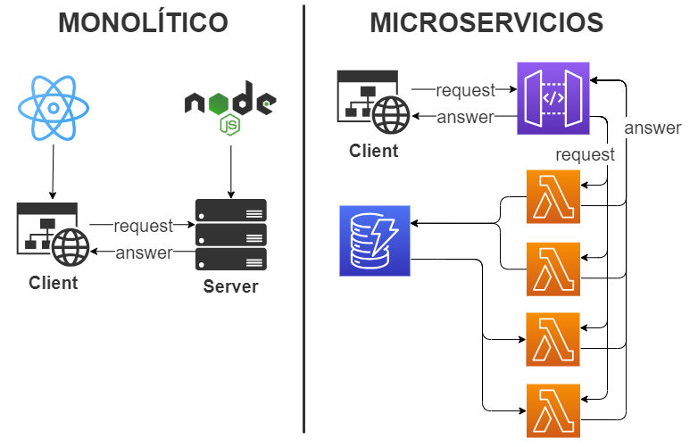
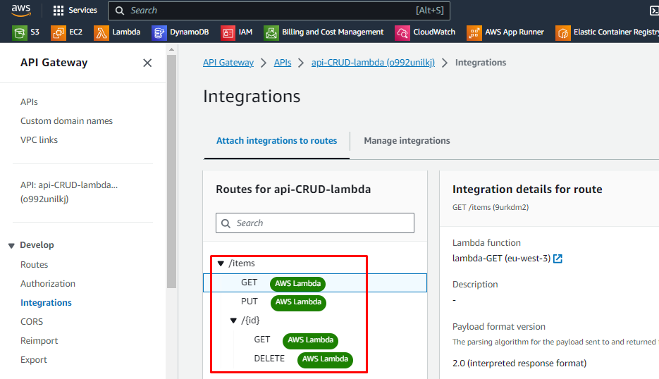
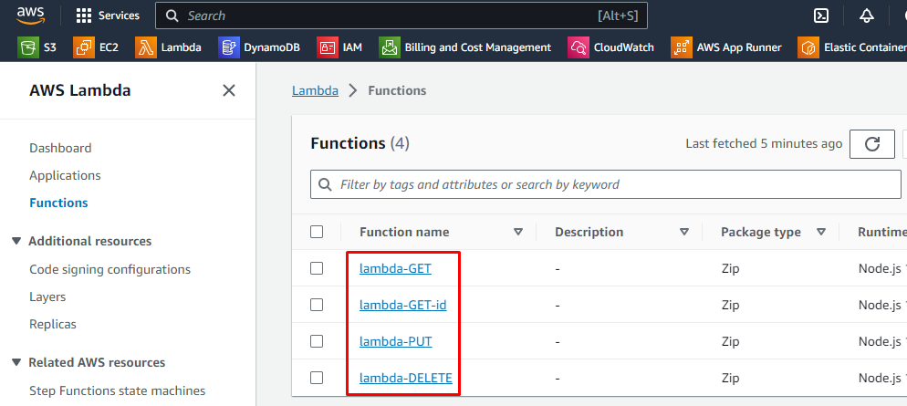

# Serverless Back-End



En este ejemplo vamos a ilustrar en un pequeño ejemplo el funcionamiento de un backend creado con microservicios y con elementos serverless como los siguientes:

## DynamoDB:

DynamoDB es una base de datos serverless no relacional.

## Lambda:

Una Lambda consiste en una función sin servidor. Su proposito en nuestra arquitectura es nacer, ejecutarse y desaparecer.

## API gateway:

Api gateway es la aplicación que conecta el front end con las funciones lambda. Es la encargada de decidir que lambda ejecutar en función de los endpoints de la app y los tipos de solicitud (GET, PUT, DELETE, etc.).

## Nuestro ejemplo: 

En el ejemplo que vamos a ver tenemos un endpoint llamado /items y cuatro posibles operaciones:

- Guardar información en la base de datos.
- Leer todas la información guardada en la base de datos.
- Leer un elemento concreto de la base de datos.
- Eliminar un elemento concreto de la base de datos.



Para gestionar las operaciones configuraremos nuestra *api gateway* para que cuando nuestro CLIENT lance una solicitud, esta ejecutará la lambda que corresponde con esa sokicitud y ese endpoint, y devolverá la respuesta a nuestro CLIENT.

- PUT url/items: Guarda los datos en la base de datos.
- GET url/items: Devuelve todos los elementos guardados en la base de datos.
- GET url/items/{id}: Devuelve el elemento {id} de la base de datos.
- DELETE url/items/{id}: Elimina el elemento {id} de la base de datos.



## Beneficios de los microservicios:

### Confiabilidad y disponibilidad:

Dado que cada microservicio es responsable de una parte específica de la aplicación, si un microservicio falla, los demás siguen funcionando. Esto aumenta la tolerancia a fallos y mejora la confiabilidad de la aplicación.

### Eficiencia en coste:

Los microservicios pueden reducir los costes operativos al facilitar el uso de recursos en todo su ciclo de vida. Por ejemplo, al usar una lambda, es decir, al implementar la arquitectura basada en el uso, se puede evitar el uso excesivo de recursos.

### Eficiencia en rendimiento:

Los microservicios pueden mejorar el rendimiento al escalar individualmente, en lugar de tener que escalar todo el servidor a la vez. Esto permite un ajuste más preciso de los recursos y, en última instancia, una mejor capacidad de respuesta al usuario.

## Microservicios en acción:

Para demostrar el funcionamiento de la *api gateway*, vamos a lanzarle unos cuantos comandos directamente a su url desde la terminal. En todos los casos sustituimos URL por la url real de nuestra api gateway, y lanzamos el comando:

**Llamamos todos los elementos de la tabla**:

curl -X "GET" -H URL/items

**Creamos un elemento en la tabla**:

curl -X "PUT" -H "Content-Type: application/json" -d "{\"id\": \"abcdef234\",\"precio\": 50,\"nombre\": \"miobjeto\"}" URL/items

**Llamamos el elemento que acabamos de crear**:

curl -X "GET" -H URL/items/abcdef234

**Eliminamos el elemento que acabamos de crear**:

curl -X "DELETE" -H URL/items/abcdef234

Las lambdas en nuestro ejemplo tienen el código siguiente:

**lambda-GET-todos**:

```javascript
const AWS = require("aws-sdk");

const dynamo = new AWS.DynamoDB.DocumentClient();

exports.handler = async (event, context) => {
  let body;
  let statusCode = 200;
  const headers = {
    "Content-Type": "application/json"
  };

  try {
    switch (event.routeKey) {
      case "GET /items":
        body = await dynamo.scan({ TableName: "lambda-crud-api" }).promise();
        break;
      default:
        throw new Error('Ruta incorrecta: "${event.routeKey}"');
    }
  } catch (err) {
    statusCode = 400;
    body = err.message;
  } finally {
    body = JSON.stringify(body);
  }

  return {
    statusCode,
    body,
    headers
  };
};
```

**lambda-GET-id**:

```javascript
const AWS = require("aws-sdk");

const dynamo = new AWS.DynamoDB.DocumentClient();

exports.handler = async (event, context) => {
  let body;
  let statusCode = 200;
  const headers = {
    "Content-Type": "application/json"
  };

  try {
    switch (event.routeKey) {
      case "GET /items/{id}":
        body = await dynamo
          .get({
            TableName: "lambda-crud-api",
            Key: {
              id: event.pathParameters.id
            }
          })
          .promise();
        break;
      default:
        throw new Error('Ruta incorrecta: "${event.routeKey}"');
    }
  } catch (err) {
    statusCode = 400;
    body = err.message;
  } finally {
    body = JSON.stringify(body);
  }

  return {
    statusCode,
    body,
    headers
  };
};
```

**lambda-PUT**:

```javascript
const AWS = require("aws-sdk");

const dynamo = new AWS.DynamoDB.DocumentClient();

exports.handler = async (event, context) => {
  let body;
  let statusCode = 200;
  const headers = {
    "Content-Type": "application/json"
  };

  try {
    switch (event.routeKey) {
      case "PUT /items":
        let requestJSON = JSON.parse(event.body);
        await dynamo
          .put({
            TableName: "lambda-crud-api",
            Item: {
              id: requestJSON.id,
              price: requestJSON.price,
              name: requestJSON.name
            }
          })
          .promise();
        body = "Item creado ${requestJSON.id}";
        break;
      default:
        throw new Error('Ruta incorrecta: "${event.routeKey}"');
    }
  } catch (err) {
    statusCode = 400;
    body = err.message;
  } finally {
    body = JSON.stringify(body);
  }

  return {
    statusCode,
    body,
    headers
  };
};
```

**lambda-DELETE**:

```javascript
const AWS = require("aws-sdk");

const dynamo = new AWS.DynamoDB.DocumentClient();

exports.handler = async (event, context) => {
  let body;
  let statusCode = 200;
  const headers = {
    "Content-Type": "application/json"
  };

  try {
    switch (event.routeKey) {
      case "DELETE /items/{id}":
        await dynamo
          .delete({
            TableName: "lambda-crud-api",
            Key: {
              id: event.pathParameters.id
            }
          })
          .promise();
        body = "Item borrado ${event.pathParameters.id}";
        break;
      default:
        throw new Error('Ruta incorrecta: "${event.routeKey}"');
    }
  } catch (err) {
    statusCode = 400;
    body = err.message;
  } finally {
    body = JSON.stringify(body);
  }

  return {
    statusCode,
    body,
    headers
  };
};
```