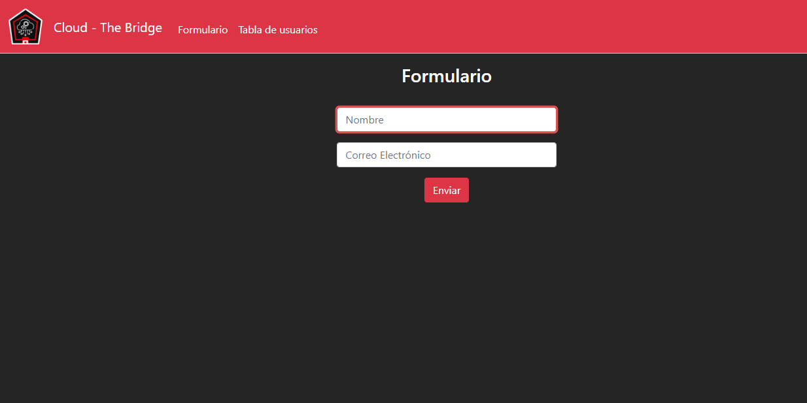
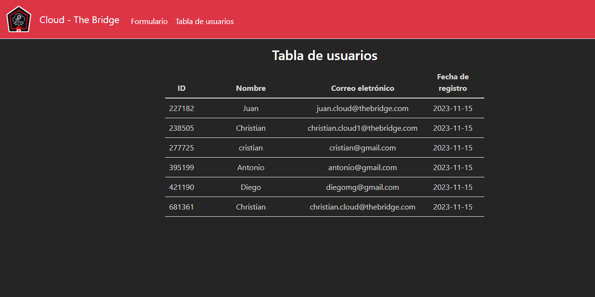

# Ejercicio Google Cloud Platform

## Parte 1 - Desplegar una cloud function:

### Planteamiento:

>Este desarrollo propone trabajar con datos donde cada vez que se crea un fichero Json en un almacenamiento, se lance una función que guarde el contenido de ese fichero en una base de datos.
> 
>
>
>Se trabaja de manera agil e intentando ir al mínimo viable por lo que el primer objetivo es utilizar google cloud platform para crear una base de datos en firestore, luego crear una cloud function que reciba a mano un json y por último que ese json lo lea desde un bucket en cloud storage. La estructura del Json que reciben es la siguiente:

```json
{
    "ID": 123456,
    "Nombre": "Juan Pérez",
    "Correo electrónico": "juan.perez@example.com",
    "Fecha de registro": "2022-01-01T10:00:00Z"
}
```

### Resolución:

Empezamos creando la base de datos con una colección llamada `firestore-juan-ejercicio-final`, y un bucket de cloud storage llamado `bucket-juan-ejercicio-final`.

 


Después preparamos una cloud function con un trigger que se lance cuando un fichero se suba al bucket. La función se compondrá por un fichero de texto y un fichero python:

**requirements.txt** - Utilizado para instalar las dependencias de la cloud function:
```
# Function dependencies, for example:
# package>=version

google-cloud-firestore==2.13.1
google-cloud-storage==2.13.0
```
 
 **main.py** - Principal componente para el funcionamiento de la función:

```python
from google.cloud import storage, firestore
import json


def frombuckettofirestore(event, context):
     """Triggered by a change to a Cloud Storage bucket.
     Args:
          event (dict): Event payload.
          context (google.cloud.functions.Context): Metadata for the event.
     """
     file = event

     # Inicia cliente de GC storage y especifica el bucket y el fichero
     storage_client = storage.Client()
     bucket = storage_client.get_bucket('bucket-juan-ejercicio-final')
     blob = bucket.blob(str(file['name']))

     # Descarga los contenidos del blob como un string y lo carga usando el metodo using json.loads()
     data = json.loads(blob.download_as_string(client=None))

     # Agrega data a firestore
     db = firestore.Client()
     db.collection("firestore-juan-ejercicio-final").document(str(data['ID'])).set(data)
```

## Parte 2 - Crear una aplicación web:

### Planteamiento:

>El siguiente requerimiento es realizar una página web que muestre toda la base de datos de usuario y la realización de un formulario web para no tener que rellenar a mano los json de usuarios y guardarlos en el almacenamiento. Como primeros pasos sirve realizar la ejecución de la web en local, y si es viable se plantean ejecutarlo en una instancia de cloud engine. 
>
>
>
>Para ello se plantean crear una aplicación web que levante un formulario y que al guardar genere un fichero json en el bucket. Cuando se genere este fichero, al crearse en cloud storage se disparará automáticamente la función que dispare el primer requerimiento y a su vez quedará actualizado en la app de seguimiento de usuarios y se mostrarán los datos en la web.

### Resolución:

La aplicación web, creada con *flask*, contiene dos páginas y estará compuesta por tres ficheros html, un fichero css y un fichero python:

**layout.html**: Plantilla para la uniformidad de la web:

```html
<!DOCTYPE html>
<html lang="en">
<head>
    <meta charset="UTF-8">
    <meta name="viewport" content="width=device-width, initial-scale=1.0">
    <!-- http://getbootstrap.com/docs/5.1/ -->
    <link crossorigin="anonymous" href="https://cdn.jsdelivr.net/npm/bootstrap@5.1.3/dist/css/bootstrap.min.css" integrity="sha384-1BmE4kWBq78iYhFldvKuhfTAU6auU8tT94WrHftjDbrCEXSU1oBoqyl2QvZ6jIW3" rel="stylesheet">
    <link href="../static/styles.css" rel="stylesheet">
    <title></title>
</head>

<body>

    <nav class="bg-danger border-bottom navbar navbar-expand-md navbar-danger" style="position: fixed; top: 0; width: 100%; z-index: 0;">
        <div class="container-fluid">
            
            <a class="navbar-brand"><span class="title">Cloud - The Bridge</span></a>
            <button aria-controls="navbar" aria-expanded="false" aria-label="Toggle navigation" class="navbar-toggler" data-bs-target="#navbar" data-bs-toggle="collapse" type="button">
                <span class="navbar-toggler-icon"></span>
            </button>
            <div class="collapse navbar-collapse" id="navbar">
                <ul class="navbar-nav me-auto mt-2">
                    <li class="nav-item"><a class="nav-link" href="/">Formulário</a></li>
                    <li class="nav-item"><a class="nav-link" href="/data">Tabla de usuarios</a></li>
                </ul>
            </div>
        </div>
    </nav>

    <main class="container-fluid py-5 text-center">
        
    </main>

    
    <div class="alert alert-danger">
        {{ message }}
    </div>
    

</body>
</html>
```

**index.html** - Página para el formulario:



```html



    <h3 class="section-title">Formulario</h3>
    <br>
    <form action="/" method="post">
        <div class="mb-3">
            <input autofocus class="form-control mx-auto w-25" id="nombre" name="nombre" placeholder="Nombre" type="text" value='{{ nom }}'>
        </div>
        <div class="mb-3">
            <input autocomplete="off" class="form-control mx-auto w-25" id="email" name="email" placeholder="Correo Electrónico" type="email" value="{{ mail }}">
        </div>
        <button class="btn btn-danger" type="submit">Enviar</button>
    </form>


```

**data.html** - Página para la tabla de datos:



```html



    Tabla de usuarios




    <h3 class="section-title">Tabla de usuarios</h3>
    <table class="table mx-auto w-50">
        <thead>
            <tr>
                <th scope="col">ID</th>
                <th scope="col">Nombre</th>
                <th scope="col">Correo eletrónico</th>
                <th scope="col">Fecha de registro</th>
            </tr>
        </thead>
        <tbody>
        
            <tr>
                <td class="center-align">{{ item["ID"] }}</td>
                <td class="center-align">{{ item["nombre"] }}</td>
                <td class="center-align">{{ item["email"] }}</td>
                <td class="center-align">{{ item["registro"] }}</td>
            </tr>
        
        </tbody>
    </table>


```

**styles.css** - Para la estética de la web, importamos la librería de *bootstrap*, y modificamos pequeños detalles con el siguiente fichero CSS:

```css
body {
    background-color: #252525;
}

main {
    margin-top: 50px;
}

.navbar {
    margin-bottom: 20px;
}

.nav-link, .navbar-brand, .navbar-brand:hover, .section-title {
    color: white;
}

.nav-link:hover{
    color: lightgray;
}

.logo {
    width: 70px;
    padding-right: 15px;
    padding-top: 5px;
    padding-bottom: 5px;
}

.table {
    color: lightgray
}

.form-control:focus {
    border-color: #d9534f;
    box-shadow: 0 0 0 0.15rem #d9534f;
} 

.alert{
    text-align: center;
}
```

**requirements.txt**: Dependencias de python:

```
google-cloud-firestore==2.13.1
google-cloud-storage==2.13.0
Flask==2.2.5
```

**app.py**: El backend que se encarga de la lógica de la web:

```python
from flask import Flask, render_template, request, redirect, flash
from google.cloud import storage, firestore
import json
import random
import datetime
import time


today = datetime.date.today().strftime('%Y-%m-%d')
todayUTC = int(time.time())

# Crea una aplicación de Flask
app = Flask(__name__)
app.config['SECRET_KEY'] = '000000'


@app.route("/", methods=["GET", "POST"])
def index():
    """
    Definición: Endpoint para la página de inicio de la web. Contiene un formulario.

    Form: Nombre - Nombre insertado por el usuario.
    Form: Correo electrónico - email insertado por el usuario.

    Return: index.html
    """
    if request.method == "POST":
        # Creamos un cliente de cloud storage para acceder al bucket
        storage_client = storage.Client()
        bucket = storage_client.get_bucket('bucket-juan-ejercicio-final')

        # Comprobamos que se han introducido los datos
        nombre = request.form.get("nombre")
        if len(nombre) == 0:
            flash("¡Introduce un nombre!")
            return render_template("index.html")
        
        email = request.form.get("email")
        if len(email) == 0:
            flash("¡Introduce un correo electrónico!")
            return render_template("index.html", nom=nombre)

        # Comprobamos que el usuario no existe en la base de datos
        db = firestore.Client()
        docs = db.collection(u'firestore-juan-ejercicio-final').stream()

        docs_dict = []
        for doc in docs:
            docs_dict.append(doc.to_dict())

        existe = False

        for d in docs_dict:
            if d['email'] == email:
                existe = True

        if existe == True:
            flash("¡Este correo electrónico ya ha sido registrado!")
            return render_template("index.html", nom=nombre, mail=email)
        else:
            # Creamos un diccionario con los datos del usuario
            usuario = {
                'ID': random.randint(100000, 999999),
                'nombre': nombre,       # Dato procedente de la web
                'email': email,         # Dato procedente de la web
                'registro': today       # Dato procedente de la variable creada arriba
            }

            try:
                # Guardamos los datos del usuario en un archivo JSON en cloud storage
                blob = bucket.blob(f'usuarios{todayUTC}.json')
                blob.upload_from_string(data=json.dumps(usuario),content_type='application/json')
                time.sleep(5)
                return redirect("/data")
            except:
                flash("¡Ha ocurrido un error! No se han almacenado los datos.")
                return render_template("index.html")
    else:
        return render_template("index.html")


@app.route("/data")
def data():
    """
    Definición: Endpoint para la página de la tabla de usuarios.

    Items - diccionario de datos extraídos de la base de datos

    return: data.html
    """

    # Configurar conexión con dynamoDB
    db = firestore.Client()
    doc_ref = db.collection(u'firestore-juan-ejercicio-final').stream()

    # Obtener los elementos de la tabla
    items = []
    for doc in doc_ref:
        items.append(doc.to_dict())
    print(items)

    return render_template("data.html", items=items)


if __name__ == '__main__':
    # Ejecuta la aplicación
    app.run(host="0.0.0.0", port=5000, debug=False)
```

## Parte 3 - Automatización del despliegue:

### Planteamiento:

>Finalmente, para poder permitir una constante mejora de la web, se pide realizar una pipeline de despliegue utilizando cloud build y un repositorio de github.
>
>
>
>Cuando la rama *main* del repositorio se actualiza, cloud build utilizará los ficheros de la rama para crear una imágen de la web, la subirá a *google artifact registry* y la desplegará con *cloud run*.

### Resolución:

Empezamos creando un repositorio de github con rama main y rama dev, donde cambiamos la rama principal a dev, y posteriormente crear un trigger que se dispare cuando en nuestro repositorio hayan modificaciones en la rama main.


Dentro de nuestro repositorio debemos tener un *clodbuild.yaml* que configure la *cloud function* y cree una imagen de los ficheros contenidos en el repositorio, suba esa imagen a *artifact registry* y configure un *cloud run* utilizando esta imagen.

**Clodbuild.yaml** - crear function:

```yaml
steps:
- name: 'gcr.io/cloud-builders/gcloud'
  args:
  - functions
  - deploy
  - frombuckettofirestore
  - --region=europe-west1
  - --source=./cloud-function
  - --trigger-bucket=gs://bucket-juan-ejercicio-final
  - --runtime=python312
  - --allow-unauthenticated
```

**Dockerfile** - Dockerfile para la creación de la imagen:

```dockerfile
FROM python:3.12.0-alpine3.18

COPY web web/
WORKDIR web/

RUN pip install -r "requirements.txt"

CMD ["python", "app.py"]
```

**Cloudbuild.yaml** - Crear imagen y subirla a *artifact registry*:

```yaml
- name: 'gcr.io/cloud-builders/docker'
  args: [ 'build', '-t', 'europe-west1-docker.pkg.dev/thebridge-sept23/juan-docker-registro/imagen-ejercicio-final:1.0', '.' ]

- name: 'gcr.io/cloud-builders/docker'
  args: ['push', 'europe-west1-docker.pkg.dev/thebridge-sept23/juan-docker-registro/imagen-ejercicio-final:1.0']
```

**Cloudbuild.yaml** - Crear *cloud run*